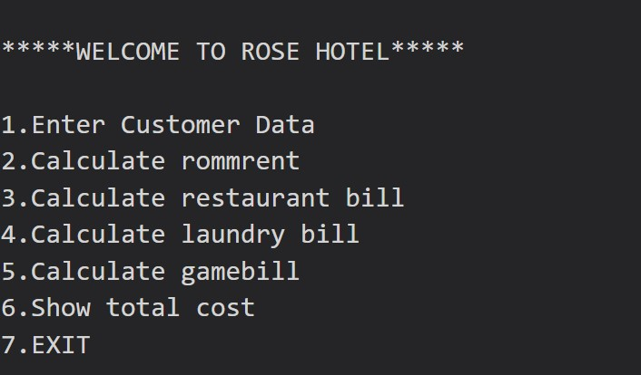

# Hotel Management System

The Student Management System project is a comprehensive system that manages all aspects of student information, academic reports, course details, and resource management. The system tracks all student details from enrollment to the completion of their course, providing a complete record for reporting purposes. It allows tracking of student progress throughout the course, including completed semesters, final exam results, and other academic milestones. The system also provides a centralized resource management system to manage all resources related to the course. The data can be easily accessed for future reference, making it an invaluable tool for academic institutions.

